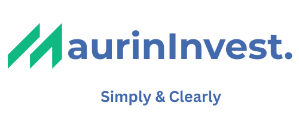
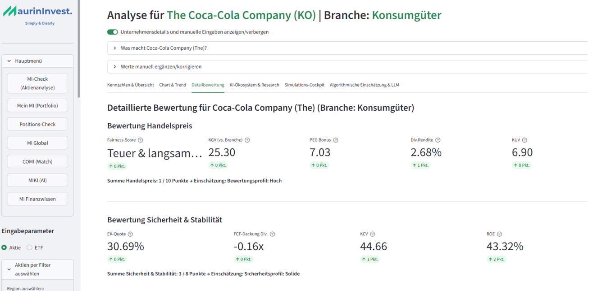
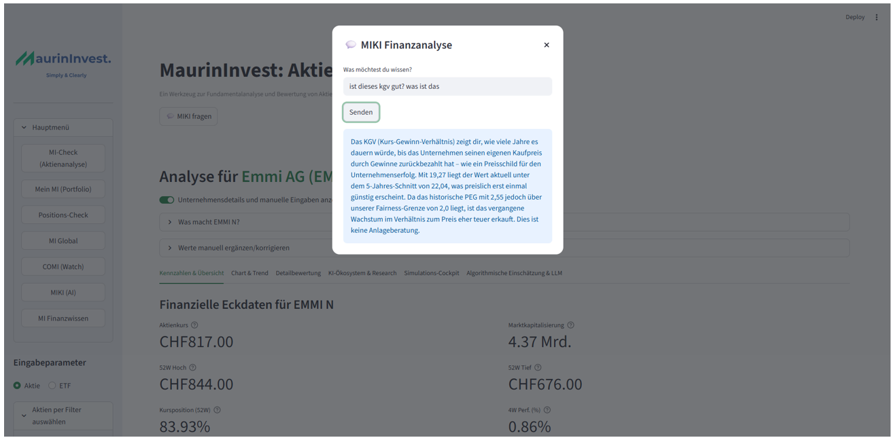
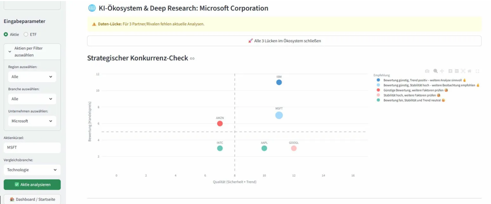
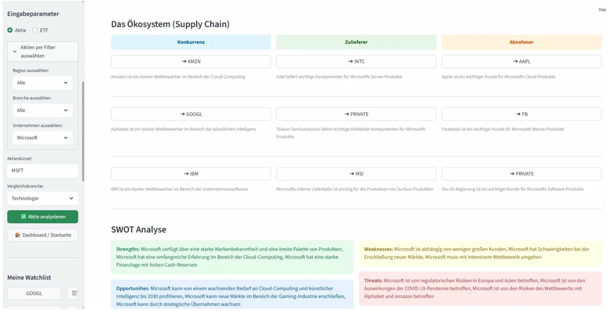
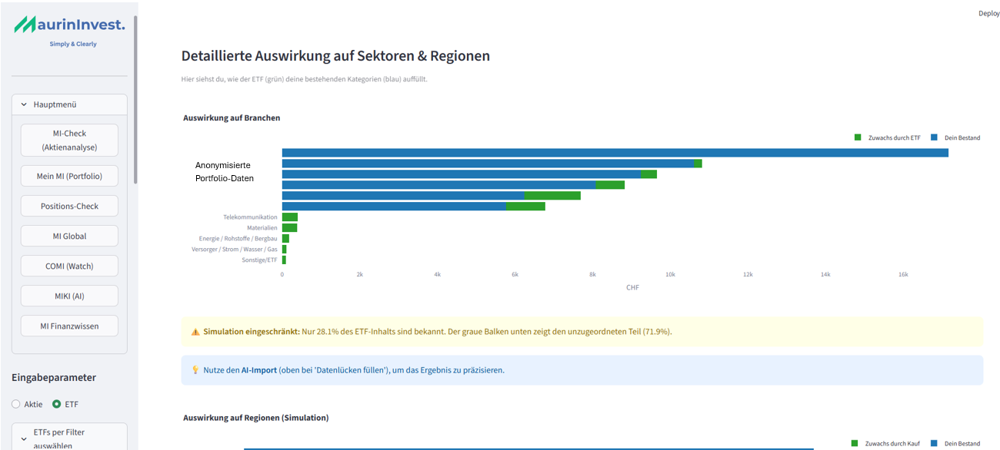
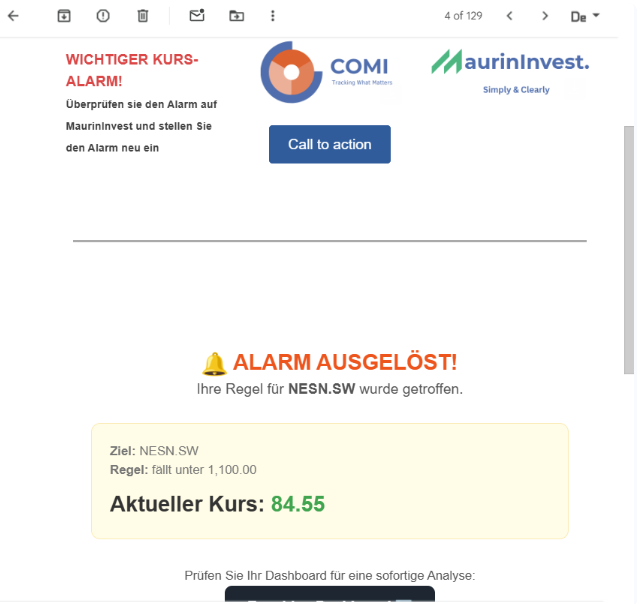
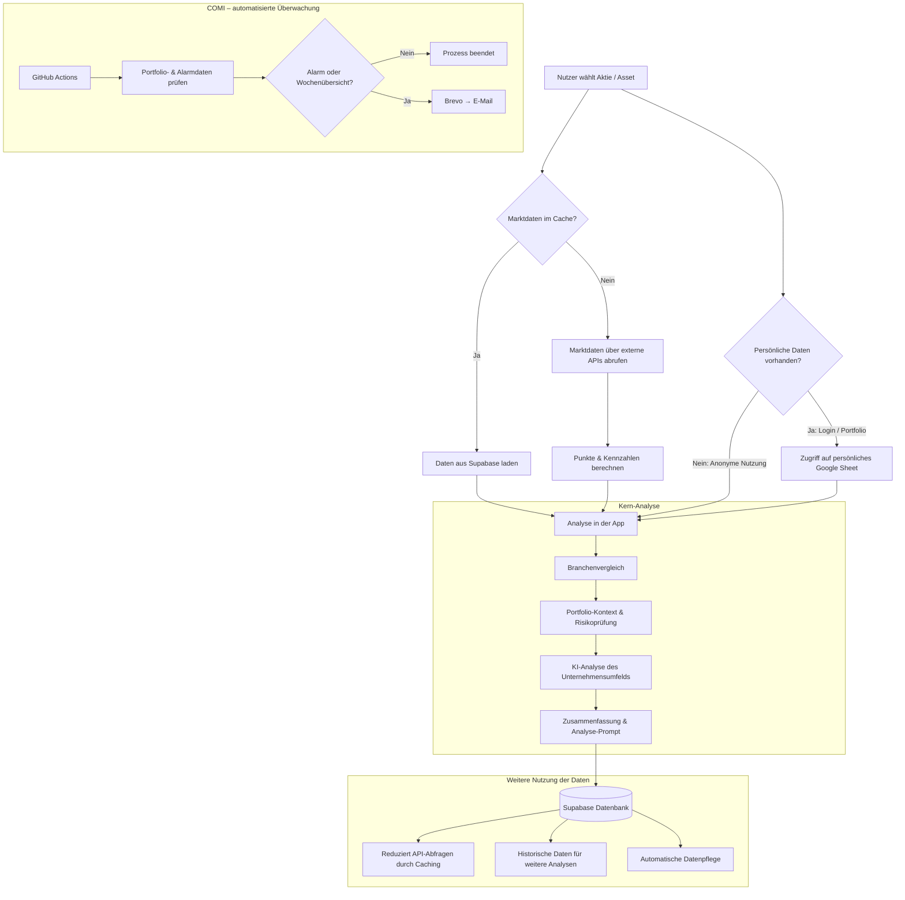

# MaurinInvest-Showcase

MaurinInvest ist eine mit Python und Streamlit entwickelte Finance-Tech-Anwendung zur Analyse von Aktien und Portfolios. Die Plattform kombiniert Fundamentaldaten, technische Kennzahlen, Branchenvergleiche und KI-gestützte Unternehmensanalysen, um Finanzinformationen verständlicher einzuordnen.

Dieses Repository dient als Showcase und Dokumentation des Projekts MaurinInvest. Der vollständige Quellcode befindet sich in einem privaten Repository, da das Projekt meine eigene Entwicklungsarbeit darstellt.

## Projektidee

Das Projekt entstand aus meinem eigenen Interesse an Investitionen und der Frage, wie Finanzkennzahlen besser eingeordnet und verständlicher dargestellt werden können.

MaurinInvest verbindet quantitative Datenanalyse mit qualitativen Unternehmensinformationen, um eine strukturierte zweite Meinung bei der Analyse von Unternehmen und Portfolios zu ermöglichen.

---

# Funktionen

## Aktienanalyse

MaurinInvest lädt automatisch Finanzdaten aus verschiedenen Quellen und bereitet diese strukturiert auf.

Enthalten sind unter anderem:

- Fundamentaldaten (z.B. Bewertung, Profitabilität, Wachstum)
- Technische Kennzahlen (z.B. RSI, SMA)
- Branchenvergleiche
- Historische Entwicklungen
- Kontextbasierte Erklärungen zu Finanzkennzahlen

Die Daten werden visualisiert und in einen verständlichen Kontext gesetzt, damit Unternehmen einfacher verglichen werden können.

---

## Branchenvergleich

Eine einzelne Kennzahl ist oft schwer einzuordnen.

MaurinInvest vergleicht Unternehmen deshalb mit Branchenwerten und zeigt:

- ob Kennzahlen über oder unter dem Branchendurchschnitt liegen
- wie sich Unternehmen innerhalb ihrer Branche positionieren
- welche Stärken und Schwächen sichtbar werden

---

## Portfolio-Analyse

Nutzer können ihr Portfolio analysieren und mögliche Auswirkungen neuer Investments simulieren.

Funktionen:

- Übersicht der Portfolio-Struktur
- Analyse von Branchen- und Regionenrisiken
- Identifikation möglicher Konzentrationsrisiken
- Simulation potenzieller Käufe (z.B. ETFs)

---

## KI-gestützte Unternehmensanalyse

Ein integriertes KI-Modul unterstützt die qualitative Analyse eines Unternehmens.

Dabei werden unter anderem betrachtet:

- Wettbewerber
- Zulieferer
- Abnehmer
- Marktumfeld

Die Analyse wird über KI-Schnittstellen generiert und unterstützt Nutzer dabei, komplexe Zusammenhänge schneller zu verstehen.

Zusätzlich erstellt MaurinInvest aus den Analyseergebnissen einen strukturierten Prompt, der für weiterführende Analysen mit externen KI-Tools verwendet werden kann.

Verwendete KI-Dienste:

- Groq API
- Google AI Studio (Gemini)

---

## Automatisierung & Benachrichtigungen

MaurinInvest beinhaltet automatisierte Hintergrundprozesse.

Dazu gehören:

- regelmässige Aktualisierung von Marktdaten
- automatische Portfolio-Prüfungen
- Benachrichtigungssystem (COMI) für relevante Veränderungen

Die Prozesse werden über GitHub Actions automatisiert ausgeführt.

---

# Screenshots

---

## Demo

Kurze Demonstration der Aktien- und Portfolioanalyse von MaurinInvest.

> **Hinweis:** Das im Video gezeigte Portfolio und die ausgewählten Unternehmen sind fiktive Demo-Beispiele und stellen nicht mein persönliches Portfolio dar. Die dargestellten Bewertungen sind automatisch generierte Analyseergebnisse und keine Anlageberatung oder Kaufempfehlung.

<video src="assets/demo-video.mp4" controls width="100%"></video>

---

## Aktienanalyse

Automatische Darstellung von Finanzkennzahlen, technischen Indikatoren und Branchenvergleich.

---

## KI-gestützte Unternehmensanalyse

Interaktive Erläuterung von Finanzkennzahlen und Analysen direkt in der Anwendung durch KI.

Analyse des Unternehmensumfelds mit Wettbewerbern, Zulieferern und Abnehmern.

---

## Portfolio-Simulation

Simulation der Auswirkungen neuer Investments auf die bestehende Portfolio-Struktur.

---

## Automatisierte Alarme & Wochenübersichten

Automatisierte Push-Benachrichtigungen durch COMI: vordefinierte Alarme bei relevanten Portfolio-Veränderungen sowie regelmässige Wochenübersichten mit den wichtigsten Entwicklungen.

---

# Technologie

## Programmiersprachen & Frameworks

- Python
- Streamlit
- SQL

## Datenverarbeitung

- Pandas
- NumPy

## Datenbanken & Backend

- Supabase

## Finanzdaten

- Financial Modeling Prep
- Finnhub
- Alpha Vantage

## KI & Automatisierung

- Groq API
- Google AI Studio
- GitHub Actions
- Brevo API

## Sicherheit & Authentifizierung

- OAuth2
- Streamlit Secrets

---

# Technische Architektur

MaurinInvest verbindet mehrere Module:

Besonderheiten der Architektur:

Caching mit Supabase: Bereits geladene Marktdaten werden zwischengespeichert, wodurch unnötige API-Anfragen reduziert und Ladezeiten verbessert werden.

Trennung persönlicher Daten: Persönliche Portfolio-Daten werden separat im persönlichen Google Sheet des Nutzers verwaltet und nicht zentral in der Datenbank gespeichert.

Kombination aus Datenanalyse und KI: Finanzkennzahlen werden mit Branchenvergleichen, Portfolio-Kontext und einer KI-gestützten Analyse des Unternehmensumfelds ergänzt.

Automatisierte Überwachung: COMI prüft Portfolio- und Alarmdaten regelmässig im Hintergrund und versendet bei relevanten Ereignissen sowie für Wochenübersichten automatisch E-Mails.

Weiterverarbeitung der Analyseergebnisse: Die Analyseergebnisse können als strukturierter Prompt für externe KI-Tools wie ChatGPT oder Claude genutzt werden.

---

# Projektumfang

Die aktuelle Version umfasst:

- mehrere tausend Zeilen Python-Code
- verschiedene externe APIs
- automatisierte Datenprozesse
- eigene Bewertungslogik
- Benutzerverwaltung und Authentifizierung

---

# Aktuelle Weiterentwicklung

Geplante Erweiterungen:

- Ausbau des Makroanalyse-Moduls
- Erweiterung der KI-Funktionen
- zusätzliche Portfolio-Analysen
- weitere Automatisierungen

---

# Autor

**Gian Fadri Jaecklin**  
Bachelor Wirtschaftswissenschaften (Schwerpunkt Banking & Finance)
Universität Zürich

Entwickelt als eigenes Finance-Tech-Projekt mit Fokus auf Datenanalyse, Investmentbewertung und Automatisierung.
